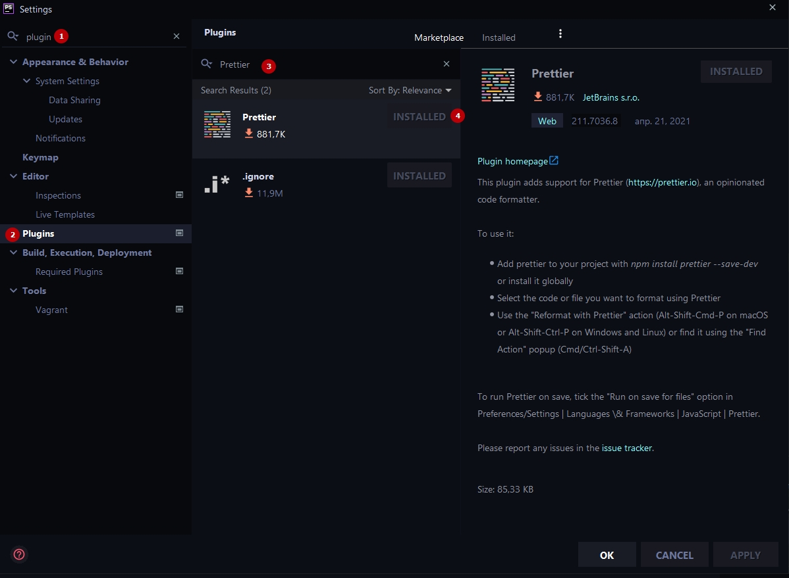
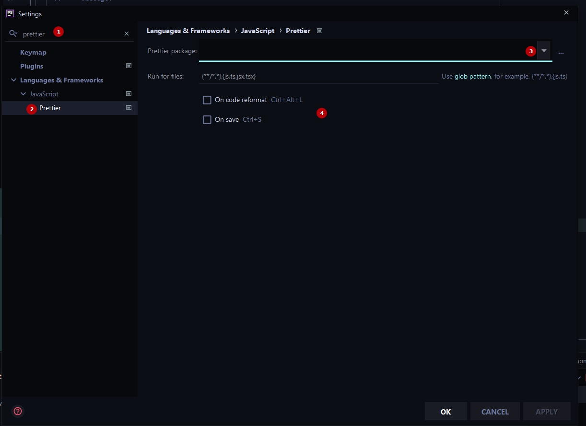

# Настройка Eslint в редакторе

### Структура
1. [Настройка плагина Prettier](#phpstorm)
2. [Правила (плагины)](#правила-plugins)
3. [Полезные ссылки](#полезные-ссылки)

#### PHPStorm
***
В первую очередь необходимо установить плагин Prettier из Marketplace

А затем активировать его, зайдя в настройки плагина (пункт 4 по желанию):
1. Найти плагин в поисковой строке
2. Открыть окно настроек
3. Выбрать из выпадающего списка путь к плагину (/node_modules/....)
4. Активировать Prettier при сохранении и форматировании

>
> #### VSCode
> ###
> Скоро появится...

#### Правила (plugins)
***
| Keywords          | Description |
| ------            | ------ |
| eslint:recommended  | [Набор базовых правил eslint](https://eslint.org/docs/rules/) |
| vue/recommended  | [Набор правил основанный на официальной руководстве по стилю для Vue-специфичного кода](https://eslint.vuejs.org/rules/) |

### Полезные ссылки
***
-- [Официальное руководство по стилю для Vue-специфичного кода](https://ru.vuejs.org/v2/style-guide/index.html)
