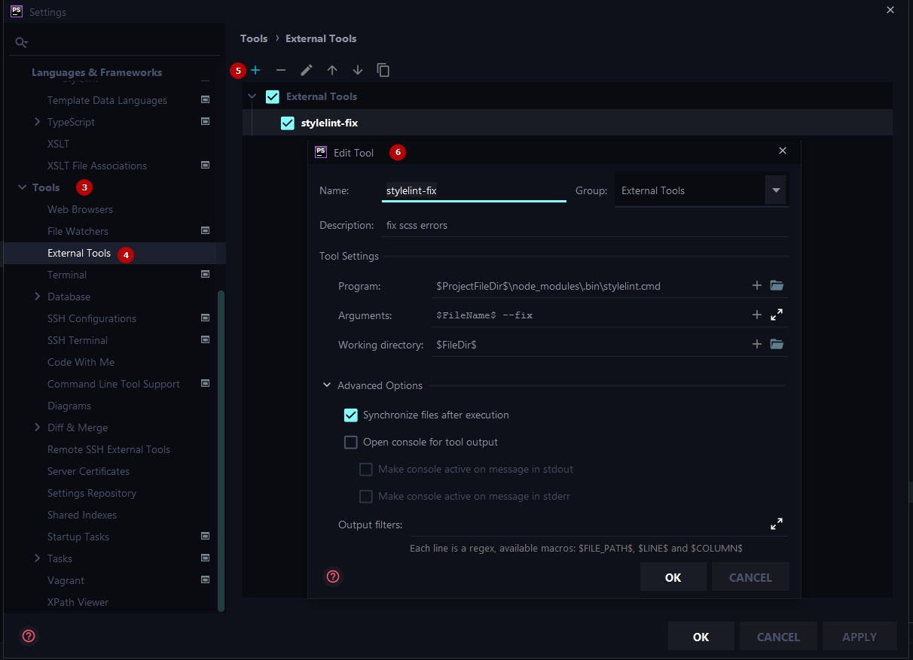
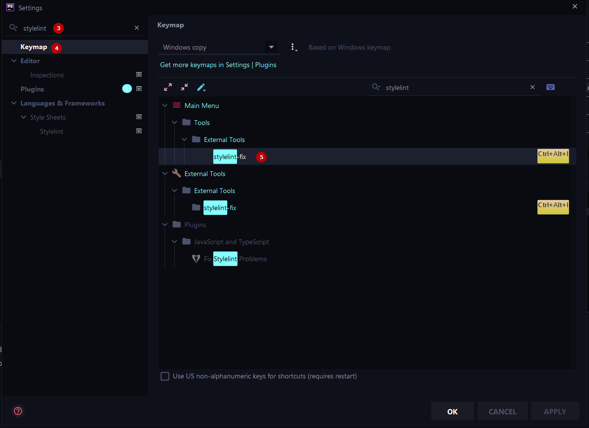
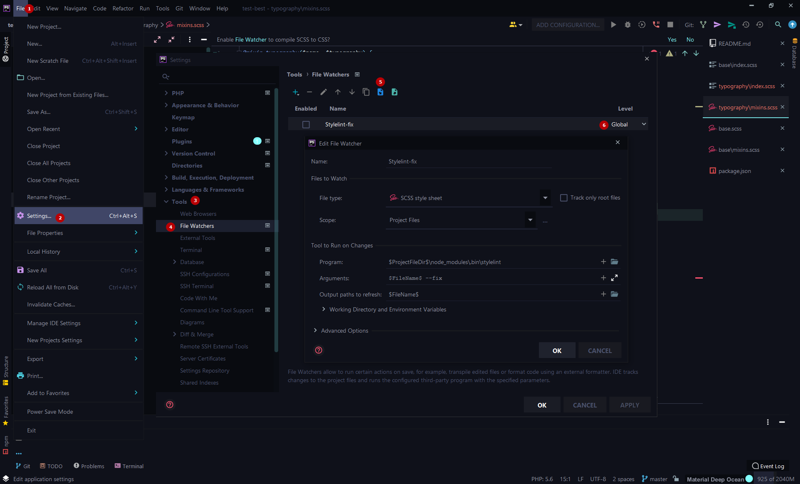

# Настройка Stylelint в редакторе кода

### Структура
1. [Добавление external tool](#добавление-external-tool)
2. [Добавление keymap](#добавление-ярлыка-keymap-для-этой-команды)
3. [Добавление File Watcher](#добавление-filewatcher-который-будет-следить-за-изменением-файлов-scss)
4. [Последовательность свойств](#последовательность-свойств-orderorder)
5. [Полезные ссылки](#полезные-ссылки)

#### PHPStorm
***

#### Добавление external tool
1. Вкладка File
2. Пункт Settings (Ctrl + Alt + S)
3. Открыть вкладку Tools
4. Пункт External tools
5. Добавить новый конфиг
6. Вставить следующие строки в поля

| Field name           | code |
| ------------------   | ------ |
| Name                 | `stylelint-fix` |
| Description          | `fix scss errors` |
| Program              | `$ProjectFileDir$\node_modules\.bin\stylelint.cmd` |
| Arguments            | `$FileName$ --fix` |
| Working directory    | `$FileDir$` |

#### Добавление ярлыка keymap для этой команды:
***
1. Вкладка File
2. Пункт Settings (Ctrl + Alt + S)
3. написать в поисковую строку stylelint
4. Открыть вкладку Keymap
5. Установить комбинацию

### Важно:
Обратите внимание на вложенность папок от корня проекта к вашим node_modules

Пример: `$ProjectFileDir$\(ваша вложенность)\node_modules\.bin\stylelint.cmd`

| Field name           | code |
| ------------------   | ------ |
| Name                 | `Stylelint-fix` |
| Program              | `$ProjectFileDir$\node_modules\.bin\stylelint.cmd`|
| Arguments            | `$FileName$ --fix` |
| Working directory    | `$FileName$` |

#### Добавление FileWatcher который будет следить за изменением файлов SCSS:
***
1. Вкладка File
2. Пункт Settings (Ctrl + Alt + S)
3. Открыть вкладку Tools
4. Пункт File Watchers
5. Импорт конфигурации [ fileWatcher](../../assets/watchers/watchers.xml)
6. Установить значение global (для всех проектов)

### Важно:
После импорта конфигурации проверьте путь к вашим node_modules

> ###
> #### VSCode
> ###
> Скоро появится...

#### Последовательность свойств (order/order)
***
| Keywords          | Description |
| ------            | ------ |
| dollar-variables  | $variable: value; |
| custom-properties | --property: 10px; |
| declarations      | CSS свойства (e. g., display: block) ([stylelint-config-rational-order](https://www.npmjs.com/package/stylelint-config-rational-order))|
| at-rule @include mixin; | @include mixin; (без вложенности в блок) |
| rules             | a { span {} } |
| at-rule @include mixin() {}  | @include mixin() {} (с вложенностью в блок) |
| at-rules          | div { @media () {}, @supports (display: flex) {} } |

### Полезные ссылки
***
-- [stylelint in phpstorm](https://stackoverflow.com/questions/59001918/integration-of-prettier-with-intellij-idea-and-npm)

-- [stylelint-order documentation](https://github.com/hudochenkov/stylelint-order/tree/master/rules/order)

-- [stylelint-config-rational-order documentation](https://github.com/constverum/stylelint-config-rational-order)
